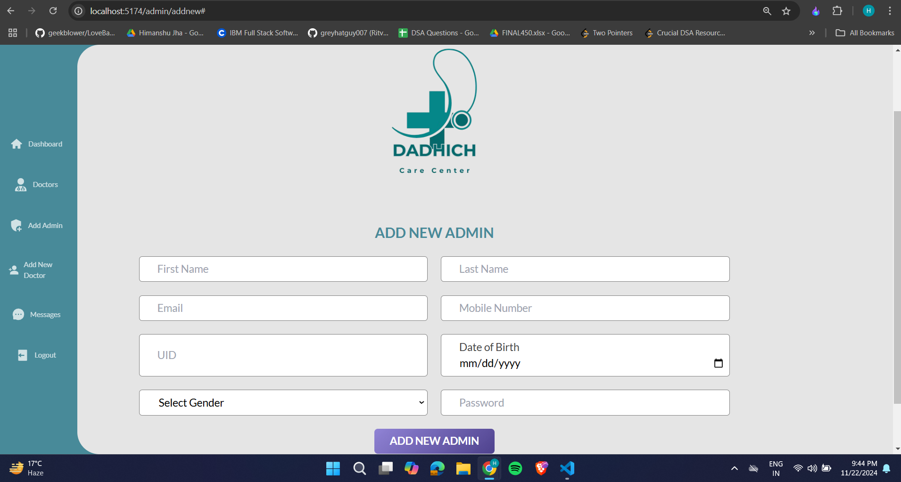

# Clinic Management System

A robust web application designed to streamline clinic operations by managing doctor appointments and providing an admin dashboard for effective control. This system is designed for ease of use by both patients and clinic administrators.

---

## Features

### **Patient Features**
- **Book Appointments:** Patients can book appointments with available doctors based on their schedules.
- **Responsive Design:** User-friendly interface accessible across devices.
- **Message Section:** Patients can leave messages or queries for the clinic.

### **Admin Dashboard**
- **Admin Management:** Add or manage admin accounts for the system.
- **Doctor Management:** Add new doctors and manage their schedules and profiles.
- **Bookings Overview:** View and manage all bookings made by patients.
- **Messages Panel:** View and respond to patient messages or inquiries.

---

## Tech Stack
- **Frontend:** React + Vite
- **Backend:** Node.js/Express 
- **Database:** MongoDB
- **Authentication:** JWT 
- **Styling:** Tailwind CSS

---

## Installation and Setup

1. **Clone the Repository**
   ```bash
   git clone https://github.com/theharshdadhich/CMS.git
   cd CMS

2. **Install Dependencies**
- For Backend:
  ```bash
  cd CMS-Backend
  npm install

- For Frontend:
    ```bash
    cd CMS-Frontend
    npm install

- For Admin:
    ```bash
    cd CMS-Admin
    npm install

3. **3. Set up Environment Variables**
Create a .env file in the root directory of the backend folder. Add the following variables:

- .env
    ```bash
        PORT =
        MONGO_URI = 
        FRONTEND_URL = 
        DASHBOARD_URL = 
        JWT_SECRET_KEY = 
        JWT_EXPIRES = 
        COOKIE_EXPIRE = 
        CLOUDINARY_CLOUD_NAME = 
        CLOUDINARY_API_SECRET = 
        CLOUDINARY_API_KEY = 

4. **Run the Application**

- Start the Backend:
    ```bash
    cd CMS-Backend 
    node server.js

- Start the Frontend:
    ```bash
    cd CMS-Frontend 
    npm run dev

- Start the Admin:
    ```bash
    cd CMS-Admin 
    npm run dev





 
